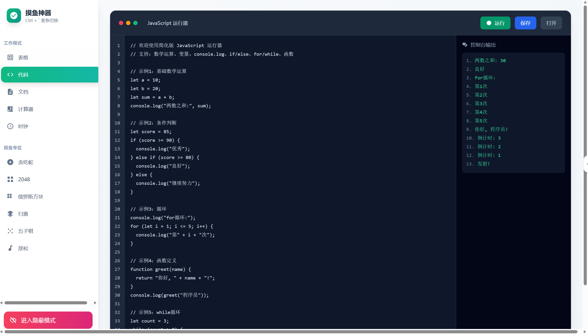
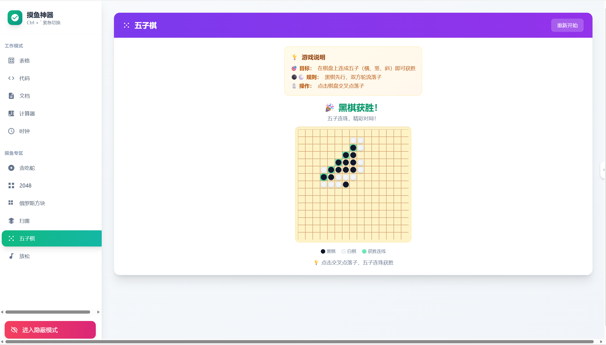
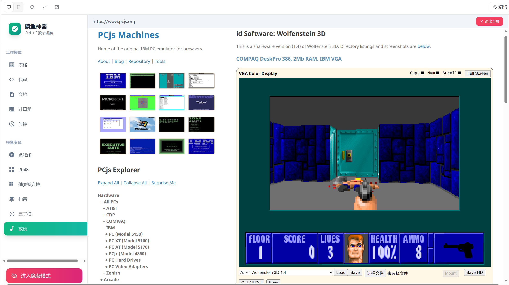
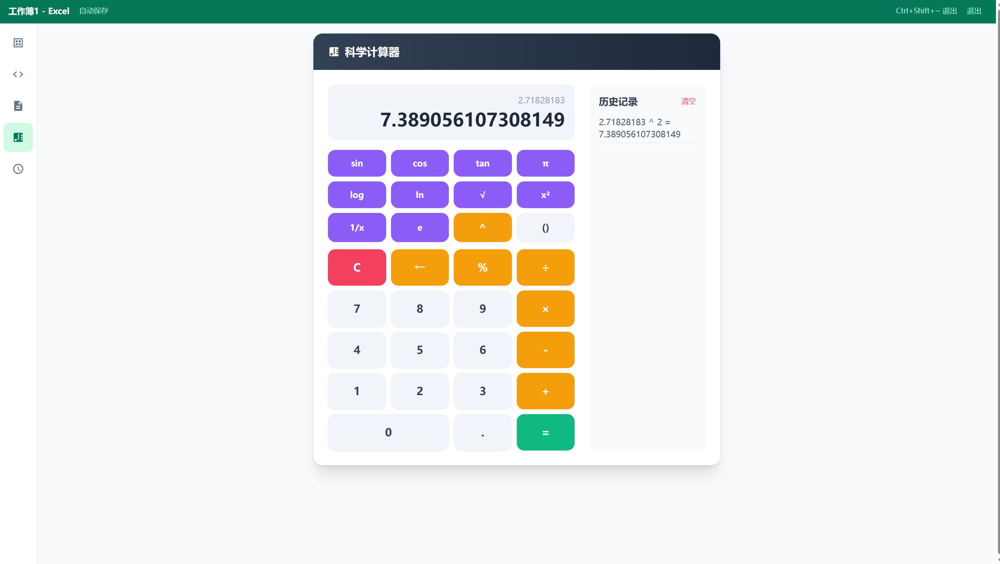

# 🎮 上班摸鱼神器

一个伪装成工作界面的休闲游戏合集，让你在上班时也能偷偷放松一下！

## ✨ 功能特色

### 🕵️ 隐蔽模式
- **Excel 表格模式**：看起来像在处理数据，实际上...
- **代码编辑器模式**：假装在写代码，实则...
- **文档编辑器模式**：伪装成在写文档

### 🎮 游戏列表
1. **贪吃蛇** - 经典怀旧
2. **2048** - 数字合成挑战
3. **俄罗斯方块** - 永不过时
4. **扫雷** - 考验推理
5. **五子棋** - 双人对弈
6. **放松时刻** - 网页浏览 + 程序员笑话

### 🛠️ 实用工具
- **科学计算器** - 支持复杂计算
- **时钟** - 显示时间、计时器、秒表

## 🚀 本地使用方法

### 方式一：直接使用（推荐）
1. 打开 `dist` 文件夹
2. 双击 `index.html` 文件即可在浏览器中运行

### 方式二：开发模式
```bash
# 安装依赖
pnpm install

# 启动开发服务器
pnpm run dev

# 构建生产版本
pnpm run build
```

## 📁 项目结构

```
├── dist/              # 构建后的文件（可直接使用）
│   ├── index.html     # 入口文件
│   └── bundle.js      # 打包后的 JS
├── images/            # 运行截图
├── src/               # 源代码
│   ├── App.tsx        # 主应用组件
│   ├── index.tsx      # 入口文件
│   ├── styles/        # 样式文件
│   └── hooks/         # 自定义 Hooks
├── package.json       # 项目配置
├── tsconfig.json      # TypeScript 配置
├── webpack.config.js  # Webpack 配置
└── tailwind.config.js # Tailwind 配置
```

## 项目预览

<div align="center">
  
  
  
  
</div>


## 🎯 使用技巧

- **Ctrl + Shift + ~**：快速进入隐蔽模式
- 所有游戏都支持键盘操作
- 工作模式的数据可以真实编辑和导出

## 📝 技术栈

- React 18
- TypeScript
- Tailwind CSS
- Framer Motion
- Webpack 5

## ⚠️ 免责声明

本工具仅供娱乐学习使用，请合理安排工作时间，切勿因摸鱼影响正常工作哦！
